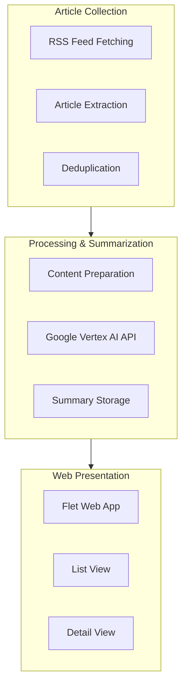

# System Patterns

## System Architecture

The weekly updates aggregator follows a data pipeline architecture with three main components:

## Key Technical Decisions

### 1. Data Collection & Processing
- **RSS Feed Integration**: Uses `feedparser` to collect content from user-defined RSS feeds (newsletters, substack, youtube channels, podcasts, blogs, etc.)
- **Asynchronous Processing**: Leverages `asyncio` for efficient concurrent processing of multiple feeds
- **HTTP Client**: Uses `httpx` for asynchronous HTTP requests to fetch article content
- **Error Handling**: Implements robust error handling with `tenacity` for retries on failures
- **Content Type Detection**: Identifies content types (articles, videos) based on URL patterns and headers
- **Date-based Filtering**: Filters content based on publication date to find new articles

### 2. AI Processing
- **Google Vertex AI**: Leverages Google's Generative AI models (Gemini) to create both short and long-form summaries
- **Batched Processing**: Processes articles in batches with rate limiting via semaphores to manage API costs
- **Schema Validation**: Uses `pydantic` models to enforce structured summary formats for consistent output
- **Retry Logic**: Implements exponential backoff with jitter for API calls to handle service limitations
- **Resource Exhaustion Handling**: Special handling for API quota exhaustion with dedicated exception types

### 3. Web Interface
- **Flet Framework**: Uses Flet (Flutter-based Python framework) for the web UI
- **Responsive Design**: Implements adaptive layouts for different screen sizes
- **Client-Side Routing**: Enables navigation between list and detail views without page reload
- **Material Design**: Follows Material Design principles with cards, shadows, and color schemes
- **Markdown Support**: Renders formatted content using Markdown for better readability

## Component Relationships

### Article Processing Pipeline
1. **Collection Stage**:
   - Reads user-defined feed URLs from `settings.json`
   - Parses each feed to extract articles using feedparser
   - Filters articles based on publication date (configurable timeframe)
   - Detects content types (text, video) based on URLs and headers

2. **Processing Stage**:
   - Prepares content for AI processing with appropriate prompts
   - Sends to Google Vertex AI (Gemini model) for summarization
   - Generates both short summaries (tweet-like) and long-form detailed summaries (Markdown)
   - Uses structured response schema to ensure consistent output format

3. **Storage Stage**:
   - Stores processed articles in `articles.json`
   - Includes metadata, short and long summaries, and URLs to original content
   - Uses ISO-formatted dates for consistency

### Web Application Flow
1. **Initialization**:
   - Loads aggregated article data from the JSON file
   - Sets up UI components and routes
   - Configures page title and styling

2. **List View**:
   - Displays article cards with title and short summary
   - Implements click handlers for navigation to detail views
   - Presents a browsable collection of updates from all sources
   - Applies consistent styling with Material Design principles

3. **Detail View**:
   - Shows article title, long summary, and source link
   - Provides back navigation to list view
   - Renders Markdown content with proper formatting
   - Enables users to navigate to original content via links

## Design Patterns

- **Async/Await Pattern**: For concurrent network operations and improved throughput
- **Retry Pattern**: For handling transient failures in API calls with exponential backoff
- **Repository Pattern**: For data access abstraction between storage and application logic
- **MVC Pattern**: Separation of data, presentation, and control logic
- **Factory Pattern**: For creating different types of views and components
- **Command Pattern**: For CLI argument handling and configuration

## Error Handling Strategy

- **Network Failures**: Retry with exponential backoff and jitter
- **API Limits**: Rate limiting via semaphores and specialized exception handling
- **Parsing Errors**: Robust error handling with fallbacks for various feed formats
- **UI Exceptions**: Graceful error state displays
- **Structured Logging**: Contextual logging with structlog for better diagnostics

## Deployment Strategy

- **Containerization**: Docker-based deployment with multi-stage builds for smaller images
- **Configuration Management**: External configuration files (settings.json)
- **Environment Variables**: For sensitive API credentials and runtime configuration
- **Lightweight Runtime**: Minimalist Python container for production
- **Exposed Port**: Container exposes port 8000 for web access
