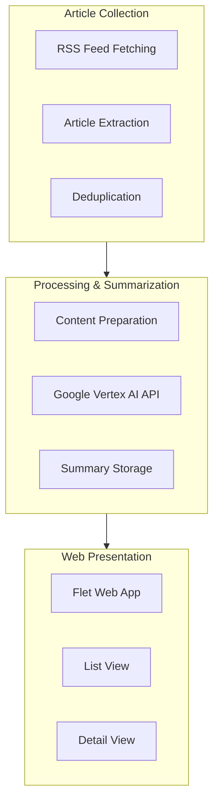

# System Patterns

## System Architecture

The weekly updates aggregator follows a data pipeline architecture with three main components:

## Key Technical Decisions

### 1. Data Collection & Processing
- **RSS Feed Integration**: Uses `feedparser` to collect content from user-defined RSS feeds (newsletters, substack, youtube channels, podcasts, blogs, etc.)
- **Asynchronous Processing**: Leverages `asyncio` for efficient concurrent processing of multiple feeds
- **HTTP Client**: Uses `httpx` for asynchronous HTTP requests to fetch article content
- **Error Handling**: Implements robust error handling with `tenacity` for retries on failures
- **Caching**: Avoids duplicate processing by tracking previously processed content

### 2. AI Processing
- **Google Vertex AI**: Leverages Google's Generative AI models to create both short and long-form summaries
- **Batched Processing**: Processes articles in batches with rate limiting to manage API costs
- **Schema Validation**: Uses `pydantic` models to enforce structured summary formats
- **Retry Logic**: Implements exponential backoff for API calls to handle service limitations

### 3. Web Interface
- **Flet Framework**: Uses Flet (Flutter-based Python framework) for the web UI
- **Responsive Design**: Implements adaptive layouts for different screen sizes
- **Client-Side Routing**: Enables navigation between list and detail views without page reload
- **Material Design**: Follows Material Design principles for a clean, user-friendly experience
- **Access to Original Content**: Provides links to view original articles

## Component Relationships

### Article Processing Pipeline
1. **Collection Stage**:
   - Reads user-defined feed URLs from `settings.json`
   - Parses each feed to extract articles from diverse content sources
   - Filters articles based on publication date

2. **Processing Stage**:
   - Prepares content for AI processing
   - Sends to Google Vertex AI for summarization
   - Generates both short and long-form summaries for different viewing contexts

3. **Storage Stage**:
   - Stores processed articles in `articles.json`
   - Includes metadata, summaries, and URLs to original content

### Web Application Flow
1. **Initialization**:
   - Loads aggregated article data from JSON file
   - Sets up UI components and routes

2. **List View**:
   - Displays article cards with title and short summary
   - Implements click handlers for navigation
   - Presents a browsable collection of updates from all sources

3. **Detail View**:
   - Shows article title, long summary, and source link
   - Provides back navigation to list view
   - Enables users to navigate to original content

## Design Patterns

- **Async/Await Pattern**: For concurrent network operations
- **Retry Pattern**: For handling transient failures in API calls
- **Repository Pattern**: For data access abstraction
- **MVC Pattern**: Separation of data, presentation, and control logic
- **Factory Pattern**: For creating different types of views and components

## Error Handling Strategy

- **Network Failures**: Retry with exponential backoff
- **API Limits**: Rate limiting and graceful degradation
- **Parsing Errors**: Robust error handling with fallbacks
- **UI Exceptions**: Graceful error state displays

## Deployment Strategy

- **Containerization**: Docker-based deployment for consistency
- **Configuration Management**: External configuration files
- **Environment Variables**: For sensitive API credentials
- **Lightweight Runtime**: Minimalist Python container for production
